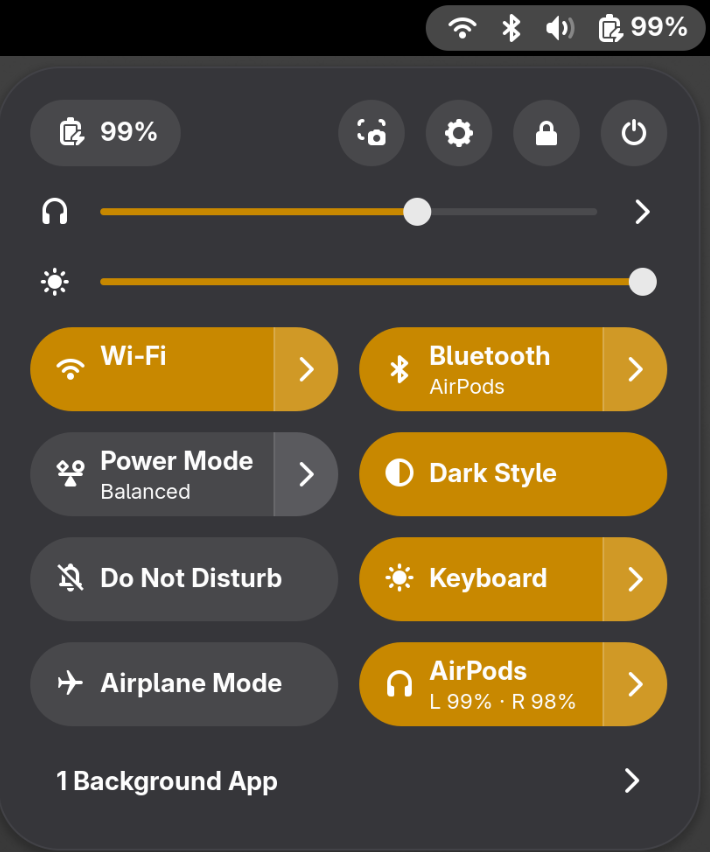
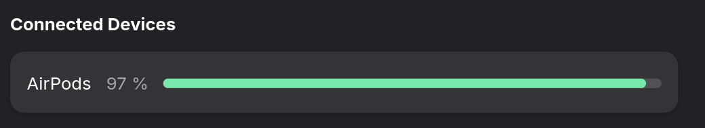

<!--
SPDX-License-Identifier: GPL-3.0-or-later
SPDX-FileCopyrightText: 2026 Scott Combs
-->

# Airprobe

Battery levels from Apple wireless earbuds, on the Linux desktop.

A user daemon speaks Apple's accessory protocol over L2CAP, publishes what it
hears on the session bus, and hands a single figure to BlueZ so the reading
shows up in GNOME Settings with no UI of its own. A Quick Settings tile shows
the two earbuds separately.





The two figures differ on purpose. The tile shows each earbud, because that is
what you want to know before a call. Settings shows the lower of the two,
because `org.bluez.Battery1` carries a single byte per device — there is no
shape in which three components reach it — and the lower figure is the honest
one to reduce them to. A full case beside two flat earbuds would read 100% and
tell you nothing useful.

(The numbers also drift between the two shots because they were taken minutes
apart and a battery in use goes down. Sampling layers of a stack minutes apart
is how a time series starts impersonating a bug.)

## What it is

Three parts, each usable without the ones above it:

| | |
|---|---|
| `libairprobe` | the protocol: socket, handshake, packet parsing. No terminal, no argv. |
| `airprobed` | user daemon. Publishes `io.github.scott8420.Airprobe1` on the session bus and registers a BlueZ battery provider on the system bus. |
| `airprobe` | a CLI probe that connects, dumps every byte both ways, and writes a transcript. |
| shell extension | a Quick Settings tile. A pure reader of the session-bus interface; does no Bluetooth work at all. |

## Status

Works, on one person's hardware, with one model of earbud (A3056). Battery is
read-only — the protocol pushes it and there is no way to ask, so there is no
refresh method and there never will be. ANC control is reachable and not
implemented.

The earbuds can only talk to one host at a time. While a phone has them,
Airprobe gets no socket. That is an environment state rather than a fault and
the daemon treats it as ordinary.

## Building

```
sudo dnf install gcc-c++ cmake bluez-libs-devel spdlog-devel fmt-devel glib2-devel
./build.sh
```

Debian/Ubuntu: `build-essential cmake libbluetooth-dev libspdlog-dev libglib2.0-dev`.

The L2CAP socket needs either membership of the `bluetooth` group (then log out
and back in) or `setcap cap_net_raw,cap_net_admin+eip` on the binary.

## Installing

```
./install.sh install AA:BB:CC:DD:EE:FF      # your device's address
```

Find the address with `bluetoothctl devices`. That installs the systemd user
service, the D-Bus activation file and the GNOME extension, then reports what
took. `./install.sh status` afterwards, and `./install.sh uninstall` to undo it.
Nothing needs root.

The extension needs a logout before GNOME Shell will see it, and it declares a
single shell version in `metadata.json` — version checking is strict, so
`./install.sh adopt-version` if yours differs.

## Design notes

Two ideas run through the whole thing, and they explain most of what looks
over-careful.

**Absent, unreadable and zero are three different answers.** The packet can
omit a component, include it with a byte that means nothing, or report a real
0%. Each is preserved from the parser to the D-Bus dictionary to the tile,
where the first two finally render as an em dash. A percentage that is
plausible and wrong will sit in a user interface indefinitely, believed.

**Where the format cannot carry the doubt, do not publish the number.**
`org.bluez.Battery1` is a single byte with no notion of age, so when the
earbuds leave the machine the reading is *withdrawn* rather than left to go
stale — GNOME Settings would otherwise show a three-hour-old figure as current
forever. Our own interface keeps the reading and publishes `BatteryAgeMs`
alongside it, because there a consumer can say how old it is. Same rule, two
opposite behaviours, decided by what the wire format can express.

`--self-test` never registers a BlueZ provider, for the same reason: synthetic
data can be labelled on our interface and cannot be labelled on BlueZ's.

## The interface

`io.github.scott8420.Airprobe1` at `/io/github/scott8420/Airprobe`, session bus,
read-only.

| property | type | |
|---|---|---|
| `Address` | `s` | the device this daemon is bound to |
| `Phase` | `s` | `closed` / `wait-handshake-ack` / `wait-features-ack` / `listening` |
| `ChannelOpen` | `b` | is the channel up *now* |
| `Status` | `s` | last thing that happened, in words, with the connect diagnosis on failure |
| `HaveBattery` | `b` | |
| `ParseRefusals` | `i` | packets whose shape the parser refused |
| `Components` | `a{sa{sv}}` | keyed `left` / `right` / `case` |
| `BatteryAgeMs` | `x` | `EmitsChangedSignal=false` — read it live, never cache it |

A missing key in `Components` means the component was not in the packet. A
present key with no `Level` means it was there and unreadable. Neither is 0%.

```
gdbus introspect --session -d io.github.scott8420.Airprobe \
                           -o /io/github/scott8420/Airprobe
```

## Credits

Protocol constants come from **[librepods](https://github.com/librepods-org/librepods)**
(GPL-3.0) and its `AAP Definitions.md`. Where the document and the working
client disagree, the client wins — both conflicts we hit are noted in the source
next to the constant. Airprobe is GPL-3.0 partly because of this: individual
constants are facts about a protocol, but a table of them, selected and arranged
by whoever did the reverse engineering, is greyer, and nobody wants to litigate
the boundary.

**[LinuxPods](https://github.com/mstroecker/LinuxPods)** independently chose
lowest-of-the-two for the figure handed to the desktop, which is what Airprobe
does. The BlueZ battery provider shape is lifted from
`bluez/test/example-battery-provider`.

## Licence

GPL-3.0-or-later, except the GNOME Shell extension under `shell-extension/`,
which is GPL-2.0-or-later — the licence GNOME Shell itself uses and the one
extensions.gnome.org expects. Both are fine for the combined work.

## Not affiliated with Apple

Not affiliated with, endorsed by, or connected to Apple Inc. AirPods is Apple's
trademark, used here only to say what this is compatible with. No Apple artwork
or icons are included; the tile uses a named icon from the system theme.
